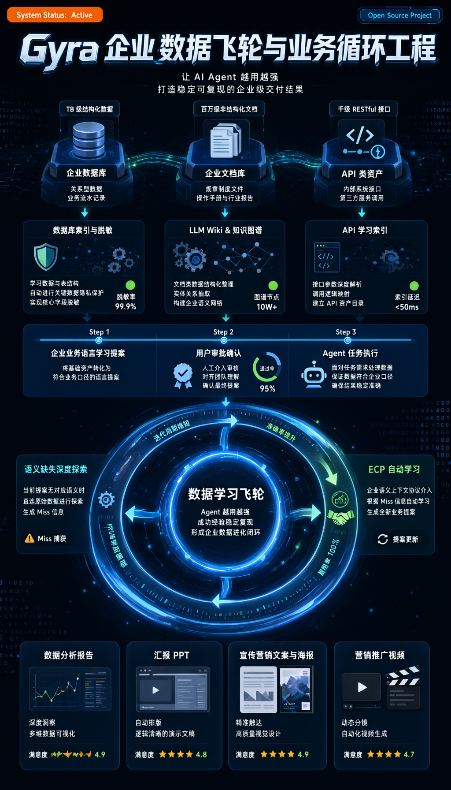

### Gyra

Gyra is an AI-native **workspace for trusted business loops** — a multi-agent development and runtime framework built on **three-layer Loop Engineering**. Agents in Gyra don't just finish one-shot tasks: they live inside business scenarios, deliver verifiable results under human-governed trust gates, and grow stronger with every loop. Our vision is to provide every production system with a 7×24 AI teammate that handles complex work and safeguards system stability. The team-native AI flywheel — compounding intelligence with every task.

<div align="center">
  <p>
    <a href="https://github.com/gyra-ai/Gyra">
        
    </a>
    <a href="https://github.com/gyra-ai/Gyra">
        
    </a>
    <a href="https://opensource.org/licenses/MIT">
      
    </a>
     <a href="https://github.com/gyra-ai/Gyra/releases">
      
    </a>
    <a href="https://github.com/gyra-ai/Gyra/issues">
      
    </a>
    <a href="https://codespaces.new/gyra-ai/Gyra">
      
    </a>
    <a href="https://discord.com/invite/bgWkskhe">
      
    </a>
  </p>

[**English**](README.md) | [**简体中文**](README.zh.md) | [**日本語**](README.ja.md) | [**Video Tutorial**](https://www.youtube.com/watch?v=1qDIu-Jwdf0)
</div>

<p align="center">
  
</p>

### Why Loop Engineering?

AI application engineering has evolved through five eras, each fixing the "unclosed loop" left by the previous one:

| Era | Core Paradigm | What It Solved | What It Left Open |
|---|---|---|---|
| **Prompt · Chatbot** | Single/multi-turn dialogue | LLMs can talk | Stateless, tool-less, everything evaporates when the chat ends |
| **Workflow** | Hand-authored flow nodes | LLMs wired into tools and pipelines | Rigid flows break on reality; every change means editing DSL |
| **ReAct** | Fully dynamic task planning | The LLM decides the next step itself | Long-horizon tasks drift, contexts explode, doom loops burn money |
| **Harness / Context Eng.** | Fine-grained runtime & context control | Managed context, constrained execution, hosted runtime | Still one-shot tasks — intelligence doesn't settle |
| **Loop Engineering (now)** | Three nested loops | AI moves from *finishing tasks* to *continuously participating in scenarios* | — |

Real business is not a sequence of isolated tasks — it is a continuous stream of events and ongoing work. An SRE doesn't "finish one root-cause analysis"; they watch alerts 7×24, respond, review, and accumulate. A data team doesn't "produce one monthly report"; they reconcile, sign off, and codify metrics month after month.

Gyra's answer is **Loop Engineering**: extend the loop from inside the model all the way out to the business scenario, and turn *sediment → reuse → evolve* into a self-driving flywheel. The full thesis lives in [Three-Layer Loop Engineering and the Five-Ring Data Flywheel: Gyra's Team-Native AI Flywheel Practice](./docs/Three_Layer_Loop_And_Five_Ring_Flywheel.md).

### The Three-Layer Loop Architecture

<p align="center">
  
</p>

| Layer | Name | Loop Essence | What It Solves | Core Carrier |
|---|---|---|---|---|
| **L1** | LLM Loop | Think → Act → Verify | Keep the model looping reliably through complex tasks | `ReActMasterAgent` |
| **L2** | Agent Loop | Memory evolution + evaluation-driven | Make the agent sharper with every task it runs | `LongTermMemoryManager` + `MemoryPromotionEngine` |
| **L3** | Business Scenario Loop | Trigger → Execute → Deliver → Distill → Evolve | Turn agents into real roles inside living business scenarios | `Workspace` + `Trigger` + `Playbook` + `Asset` |

The layers are **nested**: L3 business tasks drive L2 agent sessions, and every step inside L2 runs the L1 loop. Each layer's output feeds the layer above — *the inner loop runs stable, the outer loops grow fast*.

#### L1 · LLM Loop — Controllable Long-Horizon Execution

The core is the ReAct loop — **Thinking → Act → Verify** — implemented in [react_master_agent.py](./packages/gyra-core/src/gyra/agent/expand/react_master_agent/react_master_agent.py), with up to 300 reasoning steps per task. Making an LLM loop is easy; keeping it alive, on-track, and affordable for 300 steps is the engineering. Four gates guard the loop:

- **Doom-loop detection** — hashes "tool + normalized params" and blocks/asks after 3 identical consecutive calls, killing money-burning spin cycles before execution.
- **Context compaction** — the [ContextEngine](./packages/gyra-core/src/gyra/agent/expand/react_master_agent/context_engine/engine.py) pipelines history through `assemble → segment → layer → summarize_cold → render → guard.repair`, layering hot/warm/cold memory within budget.
- **Tool-output truncation** — oversized outputs (default 500 lines / 5KB) are archived to the agent filesystem and returned as paginated references, protecting context without losing information.
- **History pruning** — usage-triggered pruning (high-water 0.8, protected ratio 0.15) keeps breathing room in the window.

> L1's goal is not "let the LLM run forever" — it's "let the LLM finish a long-horizon task, controllably, within 300 steps."

#### L2 · Agent Loop — Growth with Every Task

L1 keeps a single task stable, but without L2 every session starts from a blank page. L2 turns *tasks already run* into *acceleration for the next one* — the real meaning of an agent that grows:

- **Tiered memory evolution** — [LongTermMemoryManager](./packages/gyra-core/src/gyra/agent/core/memory/longterm_manager.py) writes lightweight verbatim notes every turn, reflects and deduplicates across the last N turns every 10 turns, and curates/promotes at session end. Online learning, not post-mortem summarization.
- **Recall tracking** — [RecallTracker](./packages/gyra-core/src/gyra/storage/memory/recall_tracker.py) persistently records recall counts, cumulative relevance, query hashes, and cross-day recall spans for every memory.
- **Three-phase "sleep" promotion** — [MemoryPromotionEngine](./packages/gyra-core/src/gyra/storage/memory/promotion.py) mimics light/REM/deep sleep: collect candidates → pattern & concept analysis → six-dimension scoring (relevance 0.30, frequency 0.24, diversity 0.15, recency 0.15, consolidation 0.10, conceptual 0.06). Only memories repeatedly needed across questions and days get promoted to long-term.
- **Evaluation-driven** — promotion, archival, and freezing decisions are based on measurable recall data, not heuristics.

> L2's goal is not "remember everything" — it's "let what truly proves useful float up, and let the rest sink."

#### L3 · Business Scenario Loop — The Trusted Business Loop

L1 and L2 still loop at the *task* level. L3 extends the loop to the *scenario* level, turning an agent into a **real role that participates continuously**:

```
Trigger (timer / webhook / alert / manual)
  → Task created with a pinned Playbook snapshot
  → Workspace assembles context (required assets + skills + resources)
  → Agent runs autonomously (entering L1/L2 loops)
  → Gates suspend execution → Human Intervention → resume
  → Deliverables verified → four delivery types
  → Forced distill into assets → Playbook evolution proposals
```

- **Triggers** — [TriggerService](./packages/gyra-serve/src/gyra_serve/trigger/service/service.py) unifies timer (cron), webhook, alert, and manual firing. Agents listen to the scenario; they don't wait for instructions.
- **Playbooks are declarations, not workflow scripts** — a playbook declares *skills allowed, context required, gates that must involve humans, deliverables, and what must be distilled* — never step-by-step procedure. How to execute is the agent's decision, so every LLM upgrade makes execution better for free.
- **Four delivery types** — **Notify** (push to people), **Publish** (write to external systems), **Execute** (act on the real world, approval-gated), **Host** (deliverables live and run inside the workspace: dashboards, demo sites, ops-history stations).
- **Forced distill** — a task cannot close until its outputs are distilled into assets (cases, runbooks, metrics, templates). Sedimentation is enforced, not encouraged.
- **Playbook evolution** — the engine detects repeatedly-added or repeatedly-skipped steps across runs and proposes playbook edits to the owner. AI proposes, humans approve — the agent never rewrites its own playbook.

> L3's goal is not "finish tasks one by one" — it's "make the workspace thicker with use, and turn the agent into a real role in the scenario."

### Trustworthy by Design

Trust is not a prompt; it is architecture. Gyra builds the trust base of business loops on a **governance closed loop**:

```
Asset registration → spec learning → ECP proposals → human confirmation → verified semantic catalog
      ↑                                                            │
      └──────────── drift detection → new proposals ←──────────────┘
```

- **ECP semantic layer** — AI proposes semantics (entities / metrics / relations); humans confirm through a permission gate. **Numbers only come from verified metrics.** This is what makes text2SQL and data analysis safe to bet decisions on.
- **Hard gates at the tool layer** — governance is enforced by what an agent can call and touch, never by asking nicely in a prompt. Prompt soft-constraints lose to tool availability — a discipline learned from production.
- **Human on the valve, not in the pipeline** — the agent runs autonomously until it hits a point that needs a human, then becomes a to-do in *one unified inbox* (interventions, semantic confirmations, delivery approvals, handoffs). Humans clear valves; the pipeline resumes by itself.
- **AI proposes, humans decide** — playbook evolution, ECP semantics, Execute-type deliveries: every change requires human approval. This red line keeps AI *autonomous but never out of control*.

### Growable by Design

Three closed loops interlock to form the self-driving business-data flywheel:

| Closed Loop | Role | Flow |
|---|---|---|
| **Work loop** (L3 driver) | Keeps the scenario running | Playbook × Trigger → Task → Output → Delivery → Asset sedimentation (humans unblock via to-dos) |
| **Governance loop** (trust base) | Keeps data trustworthy | Asset → spec → ECP proposal → human confirm → verified catalog → drift detection |
| **Memory loop** (L2 engine) | Keeps the agent growing | Write every turn → reflect every 10 turns → promote at session end → accelerate next task |

The work loop's output feeds the memory loop; promoted memory sharpens the agents in the work loop; the governance loop keeps the data inside both loops trustworthy. Around them, **six flywheels mesh and compound**: Semantic (what data means), Playbook (how work is done), Context (scenario background), Knowledge (structured domain knowledge), Capability (tools & skills), Scenario (accumulated assets & agent expertise).

The north-star metric of the whole design is **Sedimentation Thickness**: *how fast can a new member — human or agent — reach veteran-level performance inside a workspace?* Measured by asset readiness, semantic coverage, playbook reuse rate, human valve response time, and sedimentation growth speed.

### The Workspace — AI-Native Home of Business Loops

The product unit of Gyra is not "a conversation" but **an environment**: the Scenario Workspace.

> A workspace is a prepared working environment — data connected, semantics defined, methods codified, permissions configured. Agents walk in and work; humans step in only at the gates.

It is the AI-native home page, centered on value delivery with the full achievement path visible (planning → execution → result), holding tasks, artifacts, deliveries, playbooks, and triggers — and, through Host-type delivery, it is also where deliverables permanently live and run.

### Core Features

<p align="center">
  
</p>

1. **Multi-Agent Builder** — Compose agents in a three-pane editor: system/user prompts, context resource orchestration, model & parameter tuning, skill/MCP binding, knowledge, memory, and live debug preview.
2. **Workspace (Scenario Space)** — The AI-native home page. Centers on value delivery and shows the achievement path (planning → execution → result), with tasks, artifacts, deliveries, playbooks, and triggers.
3. **ReActMasterAgent** — The long-horizon task engine: doom-loop detection, session compaction, tool-output truncation, history pruning, phased prompt management, work logs, report generation, and Kanban task planning.
4. **ECP Semantic Layer** — Trustworthy text2SQL & data analysis. AI proposes semantics (entities / metrics / relations); humans confirm via a permission gate. Numbers only come from confirmed metrics.
5. **Knowledge Vault** — A full RAG pipeline across vector (Chroma, Milvus, PGVector…), graph (Neo4j, TuGraph), and full-text stores, with S3/OSS file storage.
6. **Tools · Skills · MCP** — Built-in tools (filesystem, shell, sandbox, schedule, todo), reusable skill packs, and the Model Context Protocol for plugging in external servers.
7. **Media Generation** — Image & video generation as first-class agent tools (OpenAI, Wanxiang, Google Banana, Seedance, Sora), delivered as artifacts in the workspace.
8. **Built-in Scenarios** — AI-SRE (OpenRCA root-cause diagnosis), DataExpert, and Flame Graph Assistant, ready to use and open to extend.

### Architecture

<p align="center">
  
</p>

Gyra is organized into five layers, through which the three loops run:

- **Interaction & Product Layer** — Workspace (home), App/Agent Builder, Chat/Assistant (with the vis_manus dual-panel layout), Scene profiles, and built-in scenarios. *The user entry of L3.*
- **Agent Runtime Layer** — `ReActMasterAgent` as the core, pluggable reasoning engines (ReACT, Summary-based, RAG deep-retrieval, Context-Engineering), sub-agents, and resilient-execution controls. *The runtime core of L1 + L2.*
- **Capabilities Layer** — Tools, Skills, MCP, Knowledge Vault, Memory, and Media Generation. *L1 calls tools; L2 reads/writes memory.*
- **Data & Integration Layer** — 15+ datasources, the ECP semantic layer, channels (DingTalk/Feishu), and sandbox (local/docker/browser). *L3's triggering and delivery channels.*
- **Foundation Layer** — Model management (LLM/Embedding/Reranker), storage & vector stores, permissions/RBAC, and audit & observability. *The full-stack base.*

The essence of an agent here is **value delivery**: from one query to a delivered result, with a visible achievement path that humans can inspect and trust.

### News
- [2026/07] 🔥 Workspace-centric runtime & ECP semantic layer shipped; `ReActMasterAgent` 2.3 with resilient execution. See [Gyra V0.2 ReleaseNote](./docs/docs/Gyra_v0.2.md)
- [2025/10] Gyra V0.2 released — a future-oriented Multi-Agent development & runtime framework.

### Install (recommended)

#### Install via curl

```shell
# Download and install latest version
curl -fsSL https://raw.githubusercontent.com/gyra-ai/Gyra/main/install.sh | bash
```
#### Configuration File
After installation, the default configuration file is automatically initialized at:
`~/.gyra/configs/gyra-proxy-aliyun.toml`

Edit this file and set your API keys:
```shell
vi ~/.gyra/configs/gyra-proxy-aliyun.toml
```

#### Start 
```
gyra-server
```

### From source(development)

#### Install uv (required)

**macOS/Linux:**
```shell
curl -LsSf https://astral.sh/uv/install.sh | sh
```

**Windows:**
```shell
powershell -c "irm https://astral.sh/uv/install.ps1 | iex"
```

#### Clone and Install Dependencies

```shell
git clone https://github.com/gyra-ai/Gyra.git

cd Gyra

# Install Dependencies with uv
uv sync --all-packages --frozen \
    --extra "proxy_openai" \
    --extra "rag" \
    --extra "storage_chromadb" \
    --extra "gyras" \
    --extra "storage_oss2" \
    --extra "client" \
    --extra "ext_base" \
    --extra "channel_dingtalk"
```

> Note: `channel_dingtalk` is optional. Skip it if you don't need DingTalk channel support.

#### Start Server

**🚀 Quick Start (Zero Configuration, Recommended)**

Start without any configuration file:

```bash
# Method 1: Use quickstart command
uv run gyra quickstart

# Method 2: Use startup script
./start.sh

# Method 3: Specify port
uv run gyra quickstart -p 8888
```

After starting, visit http://localhost:7777 and configure models and settings through the web UI.

For detailed instructions, see: [Quick Start Guide](QUICKSTART.md)

**📝 Start with Configuration File**

Configure the API_KEY in `gyra-proxy-aliyun.toml`, then run:

```bash
# Start with configuration file
uv run gyra quickstart -c configs/gyra-proxy-aliyun.toml

# Or use traditional method
uv run python packages/gyra-app/src/gyra_app/gyra_server.py --config configs/gyra-proxy-aliyun.toml
```

#### Access Web UI

Open your browser and visit [`http://localhost:7777`](http://localhost:7777)

### Usage

#### Base Modules
Found under the **Settings** menu:
- **Model Management** — add / edit / remove LLM, Embedding, and Reranker models (OpenAI, Aliyun, Zhipu, local, etc.). Multi-model priority strategy supported.
- **Knowledge Base** — manage knowledge with the built-in RAG retrieval pipeline.
- **MCP** — manage and debug MCP services (CRUD + tool testing).
- **Prompts** — a unified editor for system & user prompts.

#### Build an Agent
Open **Application Management** → create or open an agent. The three-pane editor lets you configure the reasoning engine, model, skills/MCP, knowledge, and sub-agents, then debug with a live preview.

#### Built-in Scenarios
* **AI-SRE (OpenRCA root-cause diagnosis)**
  - Notice: uses the OpenRCA [Bank Dataset](https://drive.usercontent.google.com/download?id=1enBrdPT3wLG94ITGbSOwUFg9fkLR-16R&export=download&confirm=t&uuid=42621058-41af-45bf-88a6-64c00bfd2f2e)
  - Download: `gdown https://drive.google.com/uc?id=1enBrdPT3wLG94ITGbSOwUFg9fkLR-16R`
  - Extract datasets into `${gyra}/pilot/datasets`
* **Flame Graph Assistant** — upload Java/Python flame graphs from your local process for analysis
* **DataExpert** — upload metrics, logs, traces, or Excel data for conversational analysis

### Development
* **Agent Development** — see `packages/gyra-core/src/gyra/agent/expand/` (e.g. `react_master_agent`) and `packages/gyra-ext/src/gyra_ext/agent/agents/`
* **Tool Development** — Skills (`skills/`) and MCP (Model Context Protocol)
* **Gyra-Skills** — [gyra-skills](https://github.com/gyra-ai/gyra_skills)

### Design Documents
- [Three-Layer Loop Engineering and the Five-Ring Data Flywheel: Gyra's Team-Native AI Flywheel Practice](./docs/Three_Layer_Loop_And_Five_Ring_Flywheel.md) — the full Loop Engineering thesis: five eras, three nested loops, the five-ring data flywheel, and the sedimentation-thickness north star.
- [Scenario Workspace Design](./docs/SCENARIO_WORKSPACE_DESIGN.md) — the P0–P8 roadmap of the AI-native workspace.
- [RFC Proposals](./docs/rfc/README.md) — hook system, durable execution, permission model, scene profiles, resource protocol.

### Scenario Demo
Multi-Agent collaborating to handle a complex task — from one query to a delivered result, with a visible achievement path:
<p align="center">
  
</p>
<p align="center">
  
</p>

### Citation
If you find this repository helpful, please cite:
```
@misc{di2025opengyraindustrialframeworkaidriven,
      title={Gyra: An Industrial Framework for AI-Driven SRE, with Design, Implementation, and Case Studies}, 
      author={Peng Di and Faqiang Chen and Xiao Bai and Hongjun Yang and Qingfeng Li and Ganglin Wei and Jian Mou and Feng Shi and Keting Chen and Peng Tang and Zhitao Shen and Zheng Li and Wenhui Shi and Junwei Guo and Hang Yu},
      year={2025},
      eprint={2510.13561},
      archivePrefix={arXiv},
      primaryClass={cs.SE},
      url={https://arxiv.org/abs/2510.13561}, 
}
```

### Acknowledgement 
- [DB-GPT](https://github.com/eosphoros-ai/DB-GPT)
- [GPT-Vis](https://github.com/antvis/GPT-Vis)
- [MetaGPT](https://github.com/FoundationAgents/MetaGPT)
- [OpenRCA](https://github.com/microsoft/OpenRCA)

The Gyra community is dedicated to building AI-native multi-agent systems. 🛡️ We hope our community can provide you with better services, and we also hope that you can join us to create a better future together. 🤝

[](https://star-history.com/#gyra-ai/Gyra)


### Community Group

Join our DingTalk group and share your experience with other developers!
