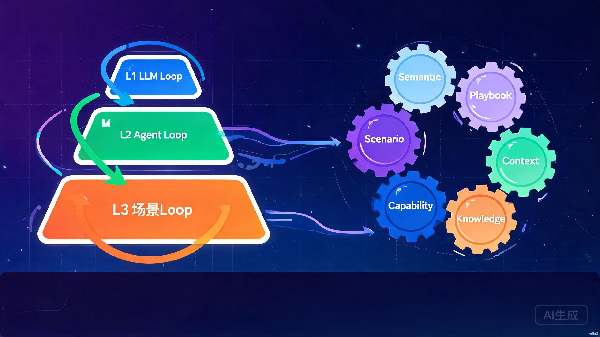
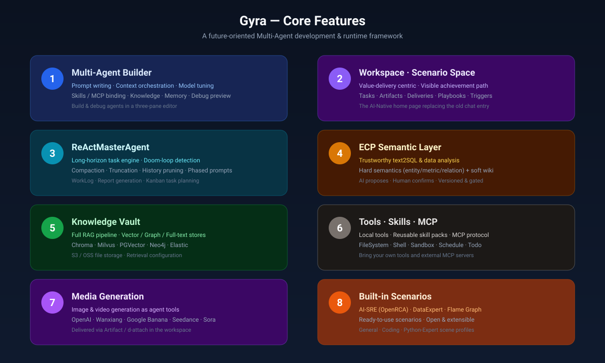
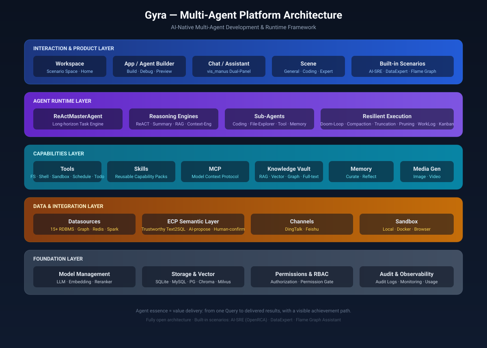

### Gyra

Gyra 是一个 AI 原生的**可信业务循环工作空间** —— 基于**三层 Loop 工程**构建的 Multi-Agent（多智能体）开发与运行框架。Gyra 里的智能体不只是完成一次性任务：它们活在业务场景里，在人来治理的可信门禁下交付可验证的结果，并随着每一次循环变得更强。我们的愿景是为每一个生产系统提供一个 7×24 小时协同工作的 AI 队友，处理复杂工作并守护系统稳定性。团队原生的 AI 飞轮 —— 越用越强。

<div align="center">
  <p>
    <a href="https://github.com/gyra-ai/Gyra">
        
    </a>
    <a href="https://github.com/gyra-ai/Gyra">
        
    </a>
    <a href="https://opensource.org/licenses/MIT">
      
    </a>
     <a href="https://github.com/gyra-ai/Gyra/releases">
      
    </a>
    <a href="https://github.com/gyra-ai/Gyra/issues">
      
    </a>
    <a href="https://codespaces.new/gyra-ai/Gyra">
      
    </a>
  </p>

[**English**](README.md) | [**简体中文**](README.zh.md) | [**日本語**](README.ja.md) | [**视频教程**](https://www.youtube.com/watch?v=1qDIu-Jwdf0)
</div>

<p align="center">
  
</p>

### 为什么是 Loop 工程？

AI 应用工程经历了五个时代，每一代都在解决上一代留下的"不闭环"问题：

| 时代 | 核心范式 | 解决了什么 | 留下了什么新问题 |
|---|---|---|---|
| **Prompt 时代 · Chatbot** | 单轮/多轮对话 | 让 LLM 能"说话" | 无状态、无工具、对话结束一切蒸发 |
| **Workflow 时代** | 人工设定流程节点 | 让 LLM 接入工具、串成流水线 | 流程刚性，现实与流程不符即崩；改流程改 DSL |
| **ReAct 时代** | 全动态规划推进任务 | LLM 自己决定下一步做什么 | 长程任务容易跑飞、上下文爆炸、死循环烧钱 |
| **Harness / Context 工程时代** | 精细化运行过程与环境管理 | 控制上下文、约束执行、托管运行时 | 仍是"一次性任务"，任务结束智慧不沉淀 |
| **Loop 工程时代（当前）** | 三层嵌套循环 | 让 AI 从"完成任务"走向"持续参与场景" | — |

真实业务不是一个个孤立任务，而是**繁乱交织的事件和持续进行的工作**。SRE 不是"完成一次故障定位"就结束，而是 7×24 持续监听告警、定位、应急、复盘、积累；数据运营不是"出一次月报"就结束，而是按月持续取数、对账、签收、沉淀口径。

Gyra 的答案是 **Loop 工程**：把"循环"从模型内部一直延伸到业务场景，并把"沉淀 — 复用 — 进化"做成自驱动的飞轮。完整论述见[三层 Loop 工程时代：Gyra 的技术思考与实践](./docs/Three_Layer_Loop_Engineering.md)。

### 三层 Loop 架构

<p align="center">
  
</p>

| 层次 | 名称 | 循环本质 | 解决什么 | Gyra 核心载体 |
|---|---|---|---|---|
| **L1** | LLM Loop | 思考 → 行动 → 验证 | 让模型循环起来解决复杂任务 | `ReActMasterAgent` |
| **L2** | Agent Loop | 记忆进化 + 评测驱动 | 让 Agent 面对复杂任务更准、更厉害 | `LongTermMemoryManager` + `MemoryPromotionEngine` |
| **L3** | 业务场景 Loop | 触发 → 执行 → 产出 → 沉淀 → 演化 | 让 Agent 在场景里变成真实角色 | `Workspace` + `Trigger` + `Playbook` + `Asset` |

三层是**嵌套驱动**关系：L3 的业务任务驱动 L2 的 Agent 会话，L2 的每一步内执行 L1 的 LLM Loop。每一层的循环产物都反哺上一层 —— **内层跑得稳，外层长得快**。

#### L1 · LLM Loop —— 可控的长程执行

核心是 ReAct 循环 —— **Thinking（思考）→ Act（行动）→ Verify（验证）**，由 [react_master_agent.py](./packages/gyra-core/src/gyra/agent/expand/react_master_agent/react_master_agent.py) 实现，单个任务最多 300 步推理。让 LLM 循环起来容易，让它在 300 步内不崩、不跑飞、不烧钱才是工程。四道闸门守护循环：

- **死循环检测** — 对"工具名 + 规范化参数"做哈希，连续 3 次相同调用即阻断或请求人确认，把"无限烧钱循环"扼杀在执行前。
- **上下文压缩** — [ContextEngine](./packages/gyra-core/src/gyra/agent/expand/react_master_agent/context_engine/engine.py) 以 `assemble → segment → layer → summarize_cold → render → guard.repair` 流水线，按预算把历史分为 hot / warm / cold 三层并压缩冷层。
- **工具输出截断** — 超限输出（默认 500 行 / 5KB）归档到 Agent 文件系统并返回分页引用，保护上下文且不丢信息。
- **历史裁剪** — 按使用率触发（高水位 0.8、保护比例 0.15），让上下文始终留有"呼吸空间"。

> L1 的目标不是"让 LLM 一直跑"，而是"让 LLM 在 300 步内可控地跑完一个长程任务"。

#### L2 · Agent Loop —— 每跑一个任务，就更强一分

L1 解决了单次任务跑得稳，但没有 L2，Agent 每次启动仍是"白纸一张"。L2 把**跑过的任务变成下次的加速** —— 这才是 Agent 真正的"成长"：

- **记忆三级进化** — [LongTermMemoryManager](./packages/gyra-core/src/gyra/agent/core/memory/longterm_manager.py) 每轮轻量写入逐字记忆（verbats），每 10 轮跨轮反思去重，会话结束执行整理与晋升。是在线学习，不是事后总结。
- **召回追踪** — [RecallTracker](./packages/gyra-core/src/gyra/storage/memory/recall_tracker.py) 持久化记录每条记忆的召回次数、累计相关度、被哪些查询召回过、跨越多少天仍被召回。
- **三阶段"做梦"晋升** — [MemoryPromotionEngine](./packages/gyra-core/src/gyra/storage/memory/promotion.py) 模拟浅睡 / 快速眼动 / 深睡：收集候选 → 模式与概念分析 → 六维评分（相关度 0.30、频次 0.24、多样性 0.15、新近性 0.15、持续性 0.10、概念性 0.06）。只有跨问题、跨天数反复被需要的记忆才晋升为长期记忆。
- **评测驱动** — 记忆的晋升、归档、冻结全部基于可度量的召回数据，而不是凭启发式规则。

> L2 的目标不是"记住所有事"，而是"让真正有用的记忆浮上来，让无用的沉下去"。

#### L3 · 业务场景 Loop —— 可信业务循环

L1 和 L2 仍在"任务"维度循环。L3 把循环扩展到**场景**维度，让 Agent 变成一个**持续参与的真实角色**：

```
触发器（定时 / Webhook / 告警 / 手动）
  → 创建任务（绑定 Playbook 快照版本）
  → 空间组装上下文（必需资产 + 技能 + 资源）
  → Agent 自主执行（进入 L1/L2 循环）
  → 命中门禁挂起 → 人工干预 → 恢复执行
  → 校验交付物 → 四类交付
  → 强制沉淀为资产 → 生成 Playbook 演化提议
```

- **触发器** — [TriggerService](./packages/gyra-serve/src/gyra_serve/trigger/service/service.py) 统一定时（cron）、webhook、告警、手动四种触发源。Agent 持续监听场景事件，而不是等人发指令。
- **Playbook 是策略声明，不是工作流脚本** — 只声明*能用哪些技能、必须加载什么上下文、什么条件下必须人介入、必须产出什么、必须沉淀什么*，不规定步骤。怎么做由 Agent 决定，LLM 编排能力每次升级，执行效果都免费变好。
- **四类交付** — **Notify 通知**（推给人/群）、**Publish 发布**（写入外部系统）、**Execute 执行**（在真实世界操作，审批门禁）、**Host 托管**（交付物在空间内长期栖居与运行：看板、demo 站、运维历史站）。
- **强制沉淀** — 任务关闭前强制校验沉淀完整性，产出物固化为资产（案例、runbook、指标、模板）。沉淀是被强制的，不是被提倡的。
- **Playbook 演化** — 引擎扫描历史执行，识别"反复出现的额外步骤"或"反复被跳过的步骤"，生成修改提议推送给 owner。AI 只提议，人审批 —— Agent 永远不自己改剧本。

> L3 的目标不是"完成一个个任务"，而是"让场景空间越用越厚，让 Agent 在场景里变成真实角色"。

### 可信，源于设计

可信不是一句提示词，而是架构。Gyra 把业务循环的可信底座建立在**治理闭环**之上：

```
资产登记 → spec 学习 → ECP 提案 → 人确认 → 语义目录(verified)
   ↑                                          │
   └────────── 漂移检测 → 新提案 ←─────────────┘
```

- **ECP 语义层** — AI 提议语义（实体 / 指标 / 关系），人通过权限门确认。**数字只能来自已确认指标。** 这让 text2SQL 和数据分析可信到敢用来做决策。
- **治理落工具面硬门禁** — 治理靠"Agent 能调什么、能碰什么"来强制执行，而不是靠在 prompt 里说"请不要做"。prompt 软约束打不过工具可用性 —— 这是实测换来的纪律。
- **人在阀门上，不在流水线里** — Agent 自动跑，跑到需要人的地方就变成一条待办，汇入**统一收件箱**（干预、语义确认、交付审批、转交）。人处理完阀门，流水线继续自动跑。
- **AI 提议，人决策** — Playbook 演化、ECP 语义确认、Execute 类执行：所有涉及"改变"的决策都必须人审批。这条红线让 AI **自主但不失控**。

### 成长，同样源于设计

三个闭环相互咬合，构成业务数据的自主飞轮：

| 闭环 | 角色 | 流转 |
|---|---|---|
| **工作闭环**（L3 主驱动） | 让场景持续运转 | 剧本 × 触发源 → 任务 → 产出 → 交付 → 资产沉淀（人通过待办解除阻塞） |
| **治理闭环**（可信底座） | 让数据可信 | 资产 → spec → ECP 提案 → 人确认 → 语义目录 → 漂移检测 |
| **记忆闭环**（L2 进化引擎） | 让 Agent 成长 | 每轮写入 → 每 10 轮反思 → 会话结束晋升 → 下次任务加速 |

工作闭环的产出喂养记忆闭环，记忆闭环的晋升反哺工作闭环的 Agent 专精，治理闭环保证两个闭环里的数据可信。环绕其外，**六个飞轮咬合传动、复利增长**：语义（数据是什么）、剧本（活怎么干）、上下文（场景背景）、知识（结构化领域知识）、能力（工具与技能）、场景（资产与 Agent 专精的积累）。

整套设计的北极星指标是**沉淀厚度**：*一个新成员（人或 Agent）进入空间，多快能达到"老师傅"的工作水平？* 以资产就绪率、语义覆盖率、剧本复用率、待办响应时长、沉淀增速五个指标度量。

### 工作空间 —— 业务循环的 AI 原生家园

Gyra 的产品单元不是"一个对话"，而是**一个环境**：场景空间。

> 场景空间 = 一个有准备的工作环境。数据已接好、口径已定义、方法已固化、权限已配好，Agent 进来就能干活，人只在关键节点介入。

它是 AI 原生的首页，围绕价值交付设计，达成路径（规划 → 执行 → 结果）全程可见，承载任务、产物、交付物、剧本与触发器 —— 并通过 Host 类交付，让交付物也在此长期栖居与运行。

### 核心特性

<p align="center">
  
</p>

1. **多智能体构建框架** — 三栏编辑器中完成智能体构建：系统/用户提示词、上下文资源编排、模型与参数调优、技能/MCP 绑定、知识、记忆，以及实时调试预览。
2. **工作空间（场景空间）** — AI 原生首页。围绕价值交付设计，展示达成路径（规划 → 执行 → 结果），包含任务、产物、交付物、剧本与触发器。
3. **ReActMasterAgent** — 长程任务推理引擎：死循环检测、上下文压缩、工具输出截断、历史裁剪、分阶段提示词管理、工作日志、报告生成与看板任务规划。
4. **ECP 语义层** — 可信的 text2SQL 与数据分析。AI 提议语义（实体/指标/关系），人工通过权限门确认，数字只能来自已确认指标。
5. **知识库** — 完整 RAG 流程，覆盖向量（Chroma、Milvus、PGVector 等）、图（Neo4j、TuGraph）与全文检索，支持 S3/OSS 文件存储。
6. **工具 · 技能 · MCP** — 内置工具（文件系统、Shell、沙箱、调度、待办）、可复用技能包，以及 MCP 协议接入外部服务。
7. **媒体生成** — 图像与视频生成作为一等公民智能体工具（OpenAI、通义万相、Google Banana、Seedance、Sora），以产物形式在工作空间交付。
8. **内置场景** — AI-SRE（OpenRCA 根因诊断）、DataExpert、火焰图助手，开箱即用且可扩展。

### 架构方案

<p align="center">
  
</p>

Gyra 分为五层，三层 Loop 贯穿其中：

- **交互与产品层** — 工作空间（首页）、应用/智能体构建器、对话/助手（vis_manus 双面板布局）、场景配置与内置场景。*L3 的用户入口。*
- **智能体运行层** — 以 `ReActMasterAgent` 为核心，可插拔推理引擎（ReACT、基于 Summary、RAG 深度检索、上下文工程），子智能体与韧性执行控制。*L1 + L2 的运行核心。*
- **能力层** — 工具、技能、MCP、知识库、记忆与媒体生成。*L1 调用工具，L2 读写记忆。*
- **数据与集成层** — 15+ 数据源、ECP 语义层、渠道（钉钉/飞书）与沙箱（本地/Docker/浏览器）。*L3 的触发与交付通道。*
- **基础层** — 模型管理（LLM/Embedding/Reranker）、存储与向量库、权限/RBAC、审计与可观测性。*全栈底座。*

这里智能体的本质是**价值交付**：从一个 Query 到可交付的结果，并带有可视、可信的达成路径。

### 最新动态
- [2026/07] 🔥 工作空间运行态与 ECP 语义层上线；`ReActMasterAgent` 2.3 韧性执行能力。详见 [Gyra V0.2 ReleaseNote](./docs/docs/Gyra_v0.2.md)
- [2025/10] 发布 Gyra V0.2 —— 面向未来的 Multi-Agent 开发与运行产品框架。

### 安装（推荐）

#### 使用 curl 安装

```shell
# 下载并安装最新版本
curl -fsSL https://raw.githubusercontent.com/gyra-ai/Gyra/main/install.sh | bash
```

#### 配置文件
安装完成后，默认配置文件已自动初始化到：
`~/.gyra/configs/gyra-proxy-aliyun.toml`

编辑该文件并设置您的 API 密钥：
```shell
vi ~/.gyra/configs/gyra-proxy-aliyun.toml
```

#### 启动
```
gyra-server
```

### 从源码安装（开发环境）

#### 安装 uv（必需）

**macOS/Linux:**
```shell
curl -LsSf https://astral.sh/uv/install.sh | sh
```

**Windows:**
```shell
powershell -c "irm https://astral.sh/uv/install.ps1 | iex"
```

#### 克隆项目并安装依赖

```shell
git clone https://github.com/gyra-ai/Gyra.git

cd Gyra

# 使用 uv 安装依赖
uv sync --all-packages --frozen \
    --extra "proxy_openai" \
    --extra "rag" \
    --extra "storage_chromadb" \
    --extra "gyras" \
    --extra "storage_oss2" \
    --extra "client" \
    --extra "ext_base" \
    --extra "channel_dingtalk"
```

> 注意：`channel_dingtalk` 为可选依赖，若不需要钉钉渠道支持可移除此行。

#### 启动服务

**🚀 快速启动（零配置，推荐）**

无需任何配置文件，直接启动：

```bash
# 方式一：使用快速启动命令
uv run gyra quickstart

# 方式二：使用启动脚本
./start.sh

# 方式三：指定端口
uv run gyra quickstart -p 8888
```

启动后访问 http://localhost:7777，通过 Web UI 配置模型和其他设置。

详细说明请查看: [快速启动指南](QUICKSTART.md)

**📝 使用配置文件启动**

在 `gyra-proxy-aliyun.toml` 中配置 API_KEY，然后运行：

```bash
# 使用配置文件启动
uv run gyra quickstart -c configs/gyra-proxy-aliyun.toml

# 或使用传统方式
uv run python packages/gyra-app/src/gyra_app/gyra_server.py --config configs/gyra-proxy-aliyun.toml
```

#### 访问 Web 界面

打开浏览器访问 [`http://localhost:7777`](http://localhost:7777)

### 使用说明

#### 基础模块
位于【配置管理】菜单下：
- **模型管理** — 新增/编辑/删除 LLM、Embedding、Reranker 模型（OpenAI、阿里云、智谱、本地等）。支持多模型优先级策略。
- **知识库** — 基于内置 RAG 检索流程管理知识。
- **MCP** — 管理与调试 MCP 服务（增删改查 + 工具测试）。
- **提示词** — 统一的系统/用户提示词编写与管理界面。

#### 构建智能体
打开【应用管理】→ 创建或打开智能体。三栏编辑器可配置推理引擎、模型、技能/MCP、知识与子智能体，并通过实时预览调试。

#### 内置场景
* **AI-SRE（OpenRCA 根因定位）**
  - 注意：默认使用 OpenRCA 数据集中的 [Bank 数据集](https://drive.usercontent.google.com/download?id=1enBrdPT3wLG94ITGbSOwUFg9fkLR-16R&export=download&confirm=t&uuid=42621058-41af-45bf-88a6-64c00bfd2f2e)
  - 下载命令：`gdown https://drive.google.com/uc?id=1enBrdPT3wLG94ITGbSOwUFg9fkLR-16R`
  - 下载后解压到 `${gyra项目}/pilot/datasets`
* **火焰图助手** — 上传本地应用服务进程的火焰图（Java/Python）进行分析
* **DataExpert** — 上传指标、日志、Trace 等 Excel 表格数据进行对话分析

### 开发
* **智能体开发** — 参考 `packages/gyra-core/src/gyra/agent/expand/`（如 `react_master_agent`）与 `packages/gyra-ext/src/gyra_ext/agent/agents/`
* **工具开发** — 技能（`skills/`）与 MCP（Model Context Protocol）
* **Gyra-Skills 开发** — [gyra-skills](https://github.com/gyra-ai/gyra_skills)

### 设计文档
- [三层 Loop 工程时代：Gyra 的技术思考与实践](./docs/Three_Layer_Loop_Engineering.md) — Loop 工程完整论述：五个时代、三层嵌套循环、六个飞轮与"沉淀厚度"北极星。
- [场景空间架构设计](./docs/SCENARIO_WORKSPACE_DESIGN.md) — AI 原生工作空间的 P0–P8 分期路线。
- [RFC 设计提案](./docs/rfc/README.md) — Hook 系统、持久化执行、权限模型、场景配置、资源协议。

### 场景演示
多智能体协同处理复杂任务 —— 从一个 Query 到可交付的结果，达成路径全程可见：
<p align="center">
  
</p>

### 引用
如对您的工作有帮助，请引用以下论文:
```
@misc{di2025opengyraindustrialframeworkaidriven,
      title={Gyra: An Industrial Framework for AI-Driven SRE, with Design, Implementation, and Case Studies}, 
      author={Peng Di and Faqiang Chen and Xiao Bai and Hongjun Yang and Qingfeng Li and Ganglin Wei and Jian Mou and Feng Shi and Keting Chen and Peng Tang and Zhitao Shen and Zheng Li and Wenhui Shi and Junwei Guo and Hang Yu},
      year={2025},
      eprint={2510.13561},
      archivePrefix={arXiv},
      primaryClass={cs.SE},
      url={https://arxiv.org/abs/2510.13561}, 
}
```

### 致谢 
- [DB-GPT](https://github.com/eosphoros-ai/DB-GPT)
- [GPT-Vis](https://github.com/antvis/GPT-Vis)
- [MetaGPT](https://github.com/FoundationAgents/MetaGPT)
- [OpenRCA](https://github.com/microsoft/OpenRCA)

Gyra 社区致力于构建 AI 原生的多智能体系统。🛡️ 我们希望社区能够为您提供更好的服务，同时也期待您的加入，共同创造更美好的未来。🤝


[](https://star-history.com/#gyra-ai/Gyra)

### 社区 

加入钉钉群，与我们一起交流讨论。
